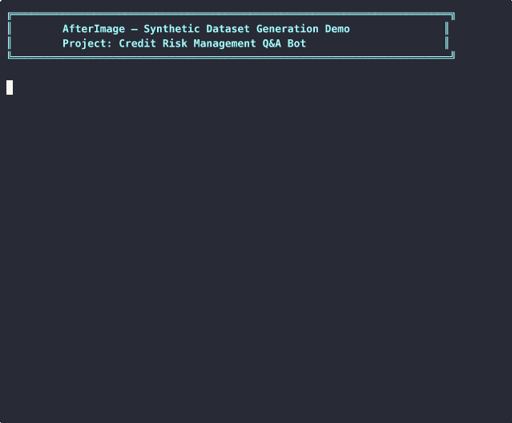

<div align="center">

# AfterImage

**Synthetic conversational dataset generation for LLM fine-tuning.**

Generate multi-turn chat data, DPO preference pairs, and structured outputs —
from a single YAML file or a composable Python API.

[](https://github.com/altaidevorg/afterimage/actions/workflows/tests.yml)
[](https://github.com/altaidevorg/afterimage/actions/workflows/ruff-format.yml)
[](https://github.com/altaidevorg/afterimage/actions/workflows/ruff-lint.yml)
[](https://pypi.org/project/afterimage)
[](https://pypi.org/project/afterimage)
[](https://pypi.org/project/afterimage)
[](LICENSE)
[](https://afterimage.altai.dev)
[](https://medium.com/altai-dev/afterimage-is-now-open-source-for-infrastructure-level-dataset-generation-e729507c3b03)

</div>

---



> Generating a document-grounded Q&A dataset from BIS credit risk principles → ShareGPT format

---

## Table of Contents

- [Why AfterImage](#why-afterimage)
- [Features](#features)
- [Installation](#installation)
- [Quickstart — CLI](#quickstart--cli)
- [Quickstart — Python API](#quickstart--python-api)
- [Supported LLM Providers](#supported-llm-providers)
- [Export Formats](#export-formats)
- [How It Works](#how-it-works)
- [Configuration Reference](#configuration-reference)
- [Repository Layout](#repository-layout)
- [Contributing](#contributing)
- [License](#license)

---

## Why AfterImage

Fine-tuning a model requires data. Real conversations are slow to collect, expensive to label, and almost never domain-specific enough.

AfterImage flips the problem: **you define what the data should look like**, and it generates it for you using any LLM you already have access to.

```
Your documents  +  LLM  →  Realistic, diverse, quality-filtered training data
```

**What you get:**

- Multi-turn conversations that read like real interactions — not templated Q&A pairs
- Document-grounded datasets tied to your corpus (RAG-style)
- DPO / RLHF preference pairs without a single manual label
- Data already formatted for the training framework you use

---

## Features

| Category | What's included |
|---|---|
| **Generation** | Multi-turn chat · Document-grounded QA · Persona-driven diversity · Structured output · Tool-calling |
| **Preference Data** | DPO · RLHF · UltraFeedback · Anthropic HH · ORPO |
| **Quality** | LLM-as-judge · Embedding-based metrics · Auto-improve retries · Composite scoring |
| **Providers** | Gemini · OpenAI · DeepSeek · OpenRouter · Local (vLLM / Ollama / llama.cpp) |
| **Export** | ShareGPT · Alpaca · Messages · LLaMA Factory · Oumi · OpenAI fine-tune · DPO · Raw |
| **Storage** | JSONL (default) · SQLite · PostgreSQL · MySQL |
| **Scale** | Async-first · Concurrent generation · Smart API key rotation with rate limiting |
| **Observability** | Real-time metrics · Configurable alerts · HTML analytics reports |
| **Interface** | CLI · Python API · FastAPI REST server · Gradio demo UI |

---

## Installation

```bash
pip install afterimage
# or with uv (recommended)
uv add afterimage
```

**Requires Python 3.11+**

**Optional extras:**

| Extra | What it adds |
|---|---|
| `embeddings-local` | Local embeddings via `sentence-transformers` for Qdrant workflows and embedding-based quality checks |
| `server` | FastAPI REST server (`afterimage-server` CLI entry point) |
| `training` | PyTorch / TRL stack, Gradio UI, and training scripts under `examples/` |

```bash
pip install "afterimage[server]"
pip install "afterimage[embeddings-local,server,training]"
```

---

## Quickstart — CLI

Set your API key and run one command:

```bash
export GEMINI_API_KEY=your_key_here
afterimage generate -c examples/configs/basic.yaml
```

Preview the plan without spending any API credits:

```bash
afterimage generate -c examples/configs/basic.yaml --dry-run
```

**Export to your training framework:**

```bash
# List all available formats
afterimage export --list-formats

# Export to multiple formats in one shot
afterimage export -i output/dataset.jsonl -f sharegpt -f messages -f alpaca

# Create a train/val split automatically
afterimage export -i output/dataset.jsonl -f messages --split 0.9

# Push directly to Hugging Face Hub
afterimage push -c your_config.yaml --repo-id your-org/your-dataset
```

**Generate DPO preference pairs:**

```bash
afterimage preference -c your_config.yaml
```

**Analyze your dataset:**

```bash
afterimage analyze -i output/dataset.jsonl -o report.html
```

---

## Quickstart — Python API

The CLI is powered by the same composable Python API. Drop into it whenever you need a custom pipeline.

**Minimal conversation generation:**

```python
import asyncio
import os
from afterimage import ConversationGenerator

async def main():
    gen = ConversationGenerator(
        respondent_prompt="You are a helpful AI assistant. Answer clearly and concisely.",
        api_key=os.environ["GEMINI_API_KEY"],
        model_name="gemini-2.5-flash",
    )
    await gen.generate(num_dialogs=50, max_turns=4, max_concurrency=5)
    print(f"Generated {len(gen.load_conversations())} conversations.")

asyncio.run(main())
```

**Document-grounded generation with personas:**

```python
import asyncio
import os
from afterimage import (
    ConversationGenerator,
    PersonaGenerator,
    PersonaInstructionGeneratorCallback,
    InMemoryDocumentProvider,
    WithContextRespondentPromptModifier,
)

DOCUMENTS = [
    "Pour-over coffee is brewed by pouring hot water over grounds through a filter. "
    "Key variables are grind size, water temperature (90–96 °C), and pour rate.",
    "Espresso is brewed at 9 bar pressure through finely-ground beans. "
    "It is the base for lattes, cappuccinos, and macchiatos.",
]

async def main():
    api_key = os.environ["GEMINI_API_KEY"]
    docs = InMemoryDocumentProvider(DOCUMENTS)

    # Generate diverse user personas from your documents
    persona_gen = PersonaGenerator(api_key=api_key)
    await persona_gen.generate_from_documents(docs)

    gen = ConversationGenerator(
        respondent_prompt="You are a coffee expert. Answer questions based on the provided context.",
        api_key=api_key,
        model_name="gemini-2.5-flash",
        instruction_generator_callback=PersonaInstructionGeneratorCallback(
            api_key=api_key,
            documents=docs,
            num_random_contexts=1,
        ),
        respondent_prompt_modifier=WithContextRespondentPromptModifier(),
    )

    await gen.generate(num_dialogs=100, max_turns=3, max_concurrency=5)

asyncio.run(main())
```

**Generate DPO preference pairs:**

```python
import asyncio
import os
from afterimage import ConversationGenerator
from afterimage.preference.generator import PreferenceGenerator
from afterimage.evaluator import ConversationJudge

async def main():
    api_key = os.environ["GEMINI_API_KEY"]

    base_gen = ConversationGenerator(
        respondent_prompt="You are a helpful assistant.",
        api_key=api_key,
        model_name="gemini-2.5-flash",
    )

    judge = ConversationJudge(api_key=api_key, model_name="gemini-2.5-flash")

    pref_gen = PreferenceGenerator(conversation_generator=base_gen, judge=judge)
    await pref_gen.generate(num_pairs=200, max_concurrency=4)

asyncio.run(main())
```

More complete examples live under [`examples/`](examples/). Full API reference is at [afterimage.altai.dev](https://afterimage.altai.dev).

---

## Supported LLM Providers

| Provider | `provider` key | Model examples | Notes |
|---|---|---|---|
| **Google Gemini** | `gemini` | `gemini-2.5-flash`, `gemini-2.0-flash` | Default in CLI configs |
| **OpenAI** | `openai` | `gpt-4o`, `gpt-4o-mini` | Full API support |
| **DeepSeek** | `deepseek` | `deepseek-chat`, `deepseek-reasoner` | Captures chain-of-thought reasoning |
| **OpenRouter** | `openrouter` | Any model via OpenRouter | Access 100+ models with one key |
| **Local** | `local` | Any OpenAI-compatible server | vLLM, Ollama, llama.cpp — zero API cost |

Providers can be mixed freely — use a fast/cheap model to simulate the user (correspondent) and a stronger model to generate answers (respondent).

**Scale beyond rate limits** with `SmartKeyPool` — automatic key rotation across concurrent requests:

```python
from afterimage.key_management import SmartKeyPool
from afterimage import ConversationGenerator

pool = SmartKeyPool(["key_1", "key_2", "key_3"])

gen = ConversationGenerator(
    respondent_prompt="You are a helpful assistant.",
    api_key=pool,
    model_name="gemini-2.5-flash",
)
```

---

## Export Formats

One command converts your raw JSONL to any fine-tuning format:

| Format | `--format` flag | Target framework |
|---|---|---|
| **ShareGPT** | `sharegpt` | LLaMA Factory · FastChat · Axolotl |
| **Alpaca** | `alpaca` | LLaMA Factory · many community trainers |
| **HuggingFace Messages** | `messages` | TRL `SFTTrainer` · HuggingFace ecosystem |
| **LLaMA Factory** | `llama_factory` | LLaMA Factory native format |
| **Oumi** | `oumi` | Oumi training framework |
| **OpenAI Fine-tune** | `openai_finetune` | OpenAI fine-tuning API |
| **DPO** | `dpo` | TRL `DPOTrainer` · preference training |
| **Raw** | `raw` | Custom pipelines — minimal processing |

```bash
# Export and split into train/val in one shot
afterimage export -i output/dataset.jsonl -f sharegpt -f messages --split 0.9
```

---

## How It Works

AfterImage runs a two-agent loop per dialog:

```
┌────────────────────────────────────────────────────────────┐
│                     ConversationGenerator                   │
│                                                            │
│   ┌──────────────────┐          ┌───────────────────────┐  │
│   │   Correspondent   │─────────▶│      Respondent       │  │
│   │  (user simulator) │◀─────────│  (assistant model)    │  │
│   └──────────────────┘          └───────────────────────┘  │
│           │                               │                 │
│   InstructionGenerator           Document Context           │
│   PersonaCallback                (RAG retrieval)            │
│   StoppingCriteria               QualityGate + Judge        │
│           │                               │                 │
│           └────────────┬──────────────────┘                 │
│                        ▼                                    │
│               Storage  (JSONL / SQL)                        │
│                        ▼                                    │
│            Export  →  Training Framework                    │
└────────────────────────────────────────────────────────────┘
```

1. **Correspondent** generates user questions — driven by personas, document context, or custom instruction callbacks
2. **Respondent** answers — with optional RAG context injected per turn
3. **Quality gate** scores each dialog using LLM-as-judge + embedding metrics; retries below-threshold dialogs automatically
4. **Storage** writes each dialog incrementally — crash-safe, resumable
5. **Export** converts the raw JSONL to any training format in a single CLI command

---

## Configuration Reference

The fastest path to generation is a YAML config:

```yaml
# examples/configs/basic.yaml

generation:
  num_dialogs: 100
  max_turns: 4
  max_concurrency: 5

model:
  provider: gemini              # gemini | openai | deepseek | openrouter | local
  model_name: gemini-2.5-flash
  api_key_env: GEMINI_API_KEY   # environment variable name

respondent:
  system_prompt: |
    You are an expert assistant. Answer clearly and concisely.

# Optional: document grounding (RAG)
# documents:
#   provider: directory         # directory | file | jsonl | memory | qdrant
#   path: ./my_docs/

# Optional: persona diversity
# personas:
#   enabled: true

# Optional: context-grounded instruction generation
# context:
#   enabled: true
#   num_random_contexts: 2

# Optional: quality gate
# quality:
#   auto_improve: true

output:
  path: ./output/dataset.jsonl
  storage: jsonl                # jsonl | sql
```

```bash
# Validate config before running
afterimage validate -c examples/configs/basic.yaml

# Run
afterimage generate -c examples/configs/basic.yaml
```

All YAML options and their defaults are documented at [afterimage.altai.dev](https://afterimage.altai.dev).

---

## Repository Layout

```
afterimage/              Core library
├── providers/           LLM, document, and embedding providers
├── callbacks/           Instruction generators, stopping criteria, prompt modifiers
├── evaluation/          LLM-as-judge and embedding-based evaluators
├── preference/          DPO / RLHF preference pair generation
├── integrations/        Export format adapters (ShareGPT, Alpaca, Messages, …)
├── analytics/           Dataset analytics engine and HTML report generator
└── server/              FastAPI REST server with SSE progress streaming

examples/
├── configs/             Ready-to-run YAML configs (basic, RAG, local, budget)
├── demo_ui/             Gradio web UI — interactive generation + fine-tuning
└── *.py                 Python API usage examples

docs/                    Sphinx sources (hosted at afterimage.altai.dev)
tests/                   pytest suite — Python 3.11, 3.12, 3.13
```

---

## Contributing

Contributions are welcome. Read [`DESIGN.md`](DESIGN.md) for architecture notes before opening a large PR.

```bash
# Clone and install all extras
git clone https://github.com/altaidevorg/afterimage
cd afterimage
uv sync --all-extras

# Run the test suite
pytest

# Check style
ruff check .
ruff format .
```

Open an issue before submitting significant changes — it helps align on design direction early and avoids wasted effort.

---

## License

[Apache License 2.0](LICENSE)

---

<div align="center">

Built by [Altai Dev](https://altai.dev) · [Documentation](https://afterimage.altai.dev) · [PyPI](https://pypi.org/project/afterimage) · [Blog](https://medium.com/altai-dev/afterimage-is-now-open-source-for-infrastructure-level-dataset-generation-e729507c3b03)

</div>

---

> **For AI agents:** To use AfterImage from an agent context, read `https://afterimage.altai.dev/llms.txt` for installation instructions, all documentation links, and runnable examples.
